# Contradiction Detection System

## Conceptual Framework & Methodology

---

## Executive Summary

The **Contradiction Detection System** is an AI-powered tool that verifies claims and statements against source documents. Users upload a document (PDF, text, or image) and input a claim to check. The system analyzes the source, extracts relevant information, and determines whether the claim is supported, contradicted, or cannot be verified based on the available evidence.

---

## 1. Core Concept: Contradiction Detection

### 1.1 Definition

**Contradiction Detection** is the process of:

1. **Parsing** a source document to extract factual information
2. **Analyzing** a user-provided claim or statement
3. **Comparing** the claim against the extracted information
4. **Returning** a verdict with supporting evidence

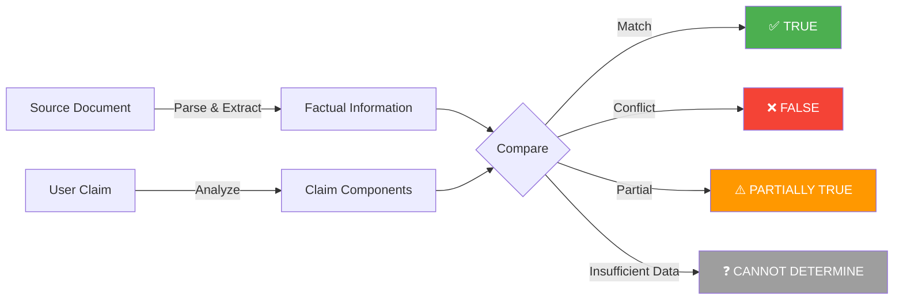

### 1.2 Why This Matters

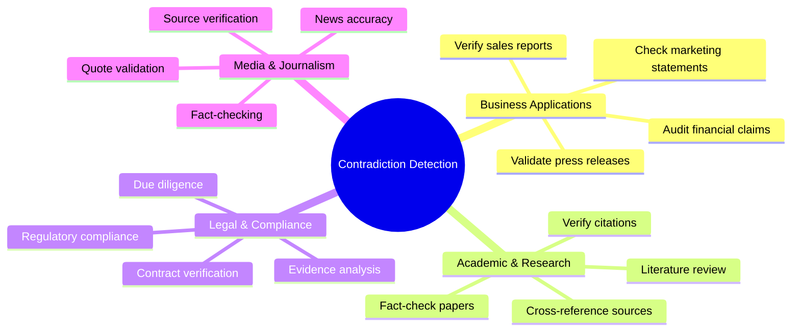

### 1.3 Types of Contradictions

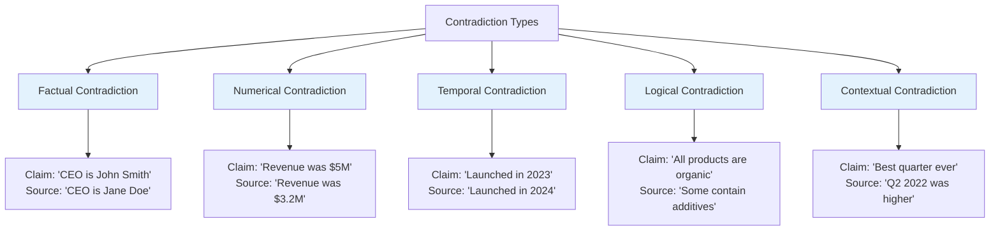

| Type           | Description                  | Example                                     |
| -------------- | ---------------------------- | ------------------------------------------- |
| **Factual**    | Direct factual mismatch      | Names, events, locations                    |
| **Numerical**  | Numbers don't match          | Revenue, percentages, counts                |
| **Temporal**   | Dates/times conflict         | Launch dates, deadlines                     |
| **Logical**    | Logical inconsistency        | "All X are Y" vs "Some X are not Y"         |
| **Contextual** | Misrepresentation of context | Cherry-picked stats, misleading comparisons |

---

## 2. System Workflow

### 2.1 High-Level Flow

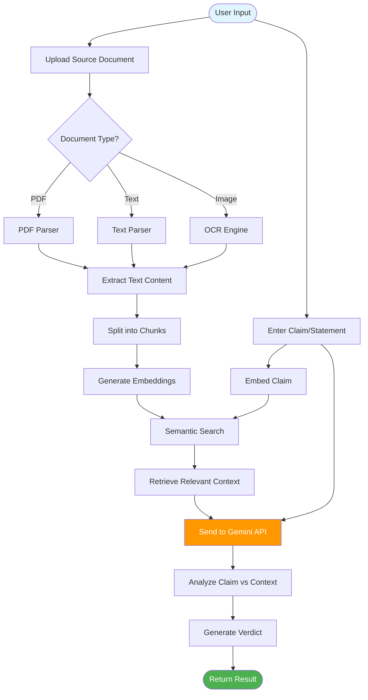

### 2.2 Detailed Processing Pipeline

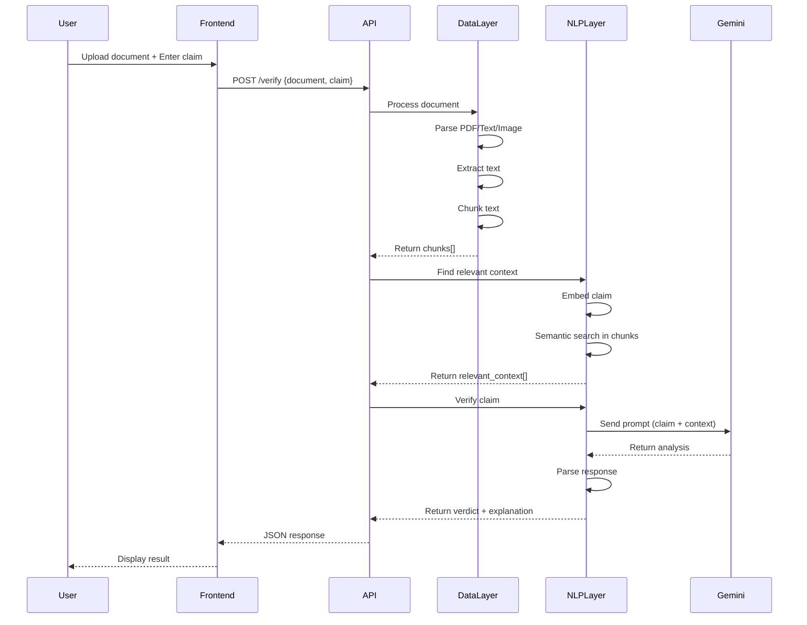

---

## 3. Core Components

### 3.1 Data Layer

The Data Layer handles all document processing:

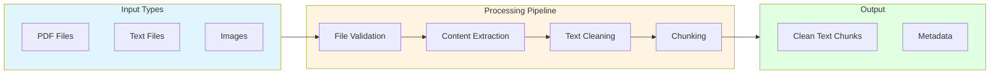

**Responsibilities:**

- Parse PDF documents (PyPDF2, pdfplumber)
- Extract text from images (Tesseract OCR)
- Clean and normalize text
- Split text into manageable chunks
- Preserve metadata (page numbers, sections)

### 3.2 NLP Layer

The NLP Layer performs the core intelligence:

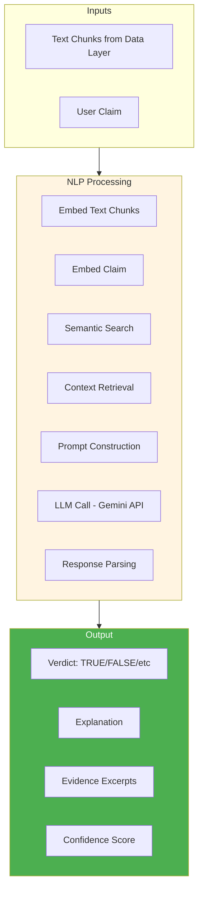

**Responsibilities:**

- Generate embeddings for semantic search
- Find relevant context for the claim
- Construct effective prompts for the LLM
- Call Google Gemini API
- Parse and structure the response
- Handle edge cases and errors

### 3.3 API/Backend Layer

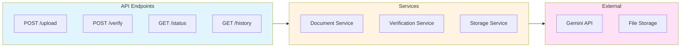

### 3.4 Frontend Layer

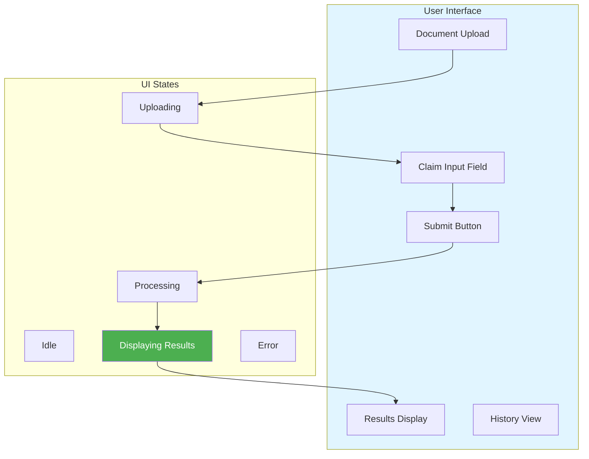

---

## 4. Verification Logic

### 4.1 Verdict Categories

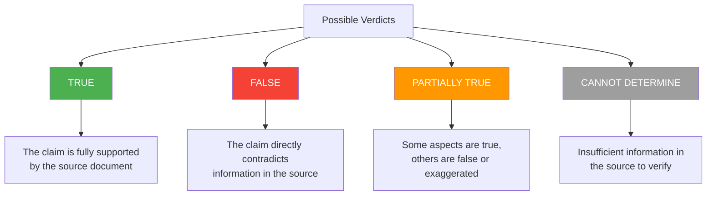

### 4.2 Verification Decision Tree

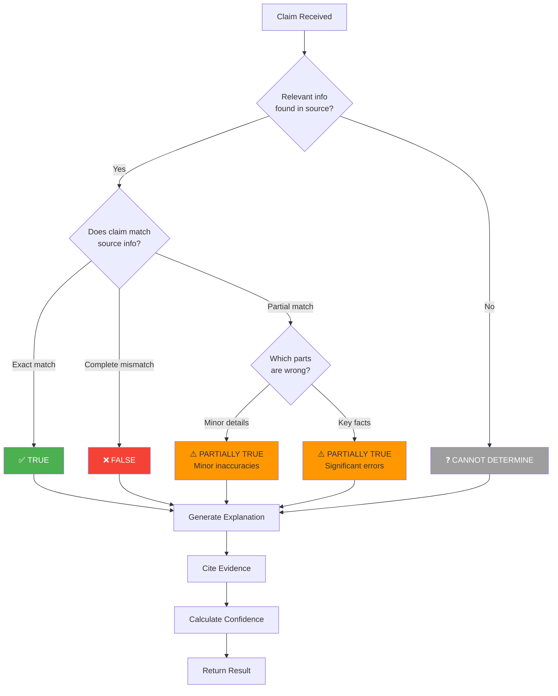

### 4.3 Confidence Scoring

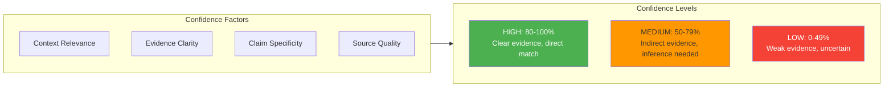

---

## 5. Use Cases

### 5.1 Business: Sales Report Verification

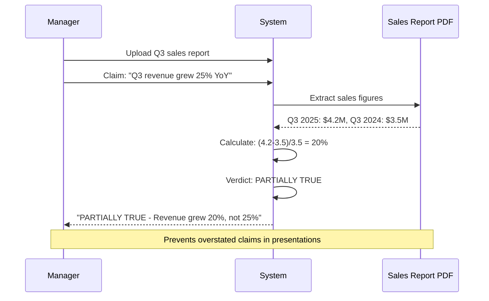

### 5.2 Academic: Research Claim Verification

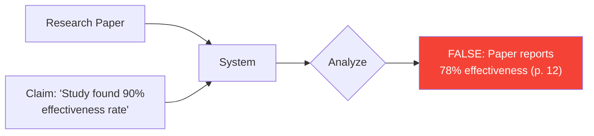

### 5.3 Legal: Contract Compliance

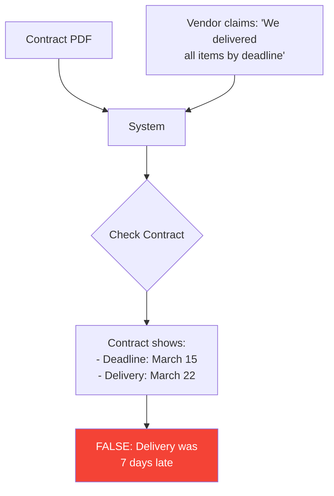

---

## 6. Technical Approach

### 6.1 Why Use an LLM (Gemini API)?

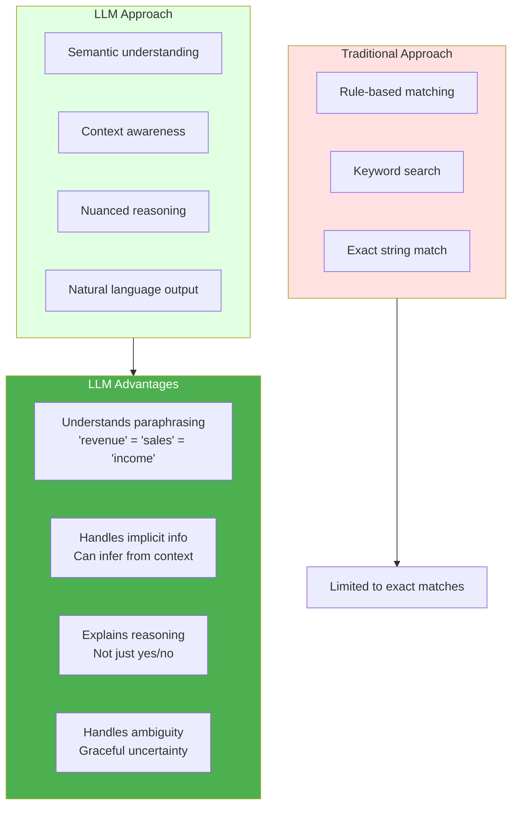

### 6.2 Chunking Strategy

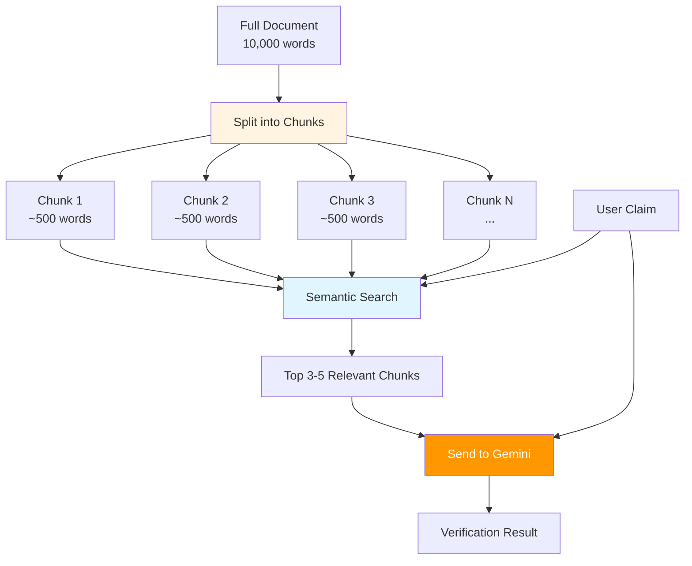

**Why Chunk?**

- LLMs have token limits (~32K for Gemini)
- Large documents exceed these limits
- Chunking + semantic search finds relevant parts
- Only relevant context is sent to LLM = better results + lower cost

### 6.3 Prompt Engineering

The prompt sent to Gemini follows this structure:

```
┌─────────────────────────────────────────────────────────┐
│ SYSTEM INSTRUCTION                                      │
│ "You are a fact-checking assistant. Your job is to     │
│ verify claims against provided source text..."          │
├─────────────────────────────────────────────────────────┤
│ CONTEXT (from source document)                          │
│ "According to the Q3 report: Revenue was $4.2M..."     │
├─────────────────────────────────────────────────────────┤
│ CLAIM TO VERIFY                                         │
│ "Q3 revenue grew 25% compared to last year"            │
├─────────────────────────────────────────────────────────┤
│ OUTPUT FORMAT INSTRUCTION                               │
│ "Respond with: VERDICT, EXPLANATION, EVIDENCE"         │
└─────────────────────────────────────────────────────────┘
```

---

## 7. Success Metrics

### 7.1 System Performance

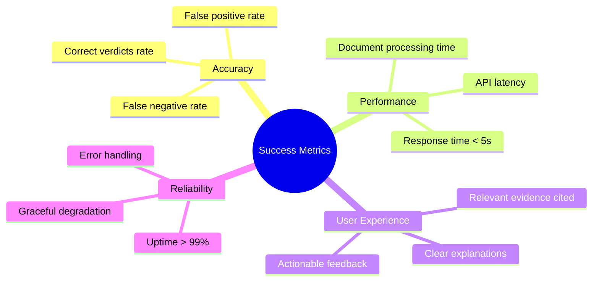

### 7.2 Key Performance Indicators

| Metric                  | Target           | Description                   |
| ----------------------- | ---------------- | ----------------------------- |
| **Accuracy**            | >85%             | Correct verdict on test cases |
| **Response Time**       | <5s              | End-to-end verification       |
| **Context Relevance**   | >90%             | Retrieved chunks are relevant |
| **Explanation Quality** | User rating >4/5 | Clarity of explanations       |

---

## 8. Limitations & Edge Cases

### 8.1 Known Limitations

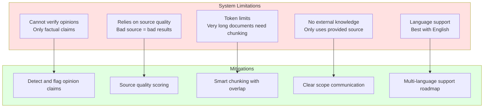

### 8.2 Edge Cases

| Edge Case                             | Handling                                            |
| ------------------------------------- | --------------------------------------------------- |
| Claim references info not in document | Return "CANNOT DETERMINE" with explanation          |
| Document is image-only                | Use OCR (may have accuracy issues)                  |
| Claim is vague/ambiguous              | Ask for clarification or flag uncertainty           |
| Multiple conflicting sources          | Note the conflict, don't make assumptions           |
| Numbers require calculation           | LLM can do basic math; complex calculations flagged |

---

## 9. Next Steps

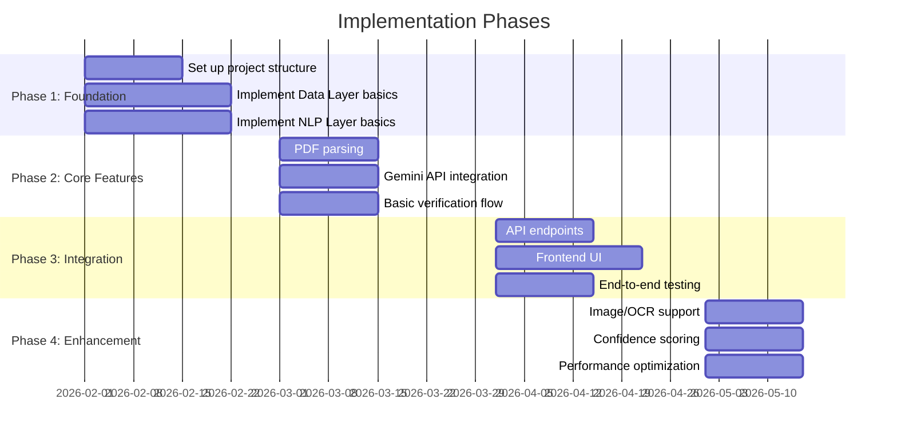

---

## Appendix: Glossary

| Term                | Definition                                              |
| ------------------- | ------------------------------------------------------- |
| **Claim**           | A statement to be verified against a source             |
| **Source Document** | The PDF, text, or image containing factual information  |
| **Chunk**           | A segment of text from the source document              |
| **Embedding**       | A vector representation of text for semantic search     |
| **Semantic Search** | Finding relevant text based on meaning, not keywords    |
| **Verdict**         | The system's determination (TRUE/FALSE/etc.)            |
| **Context**         | Relevant excerpts from the source used for verification |
| **LLM**             | Large Language Model (e.g., Gemini, GPT)                |
