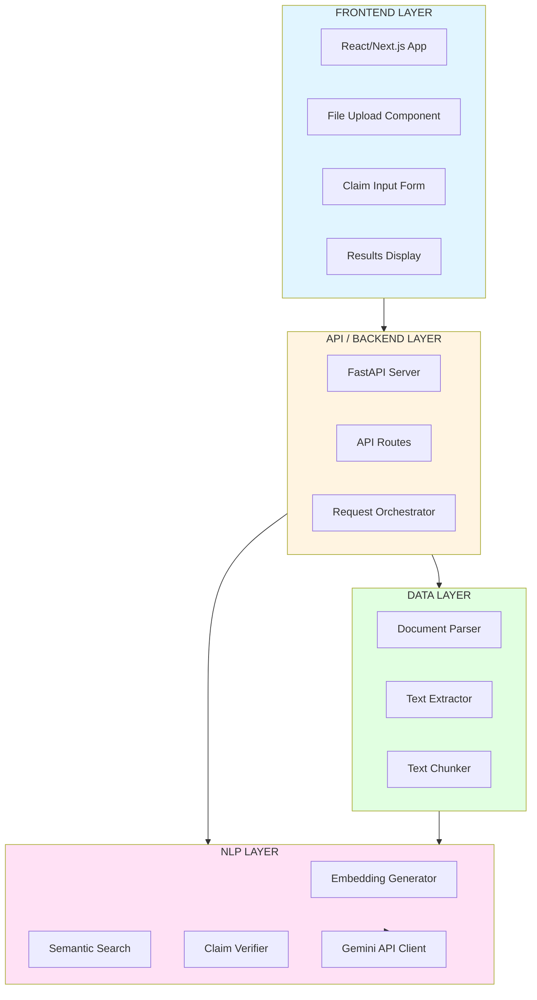
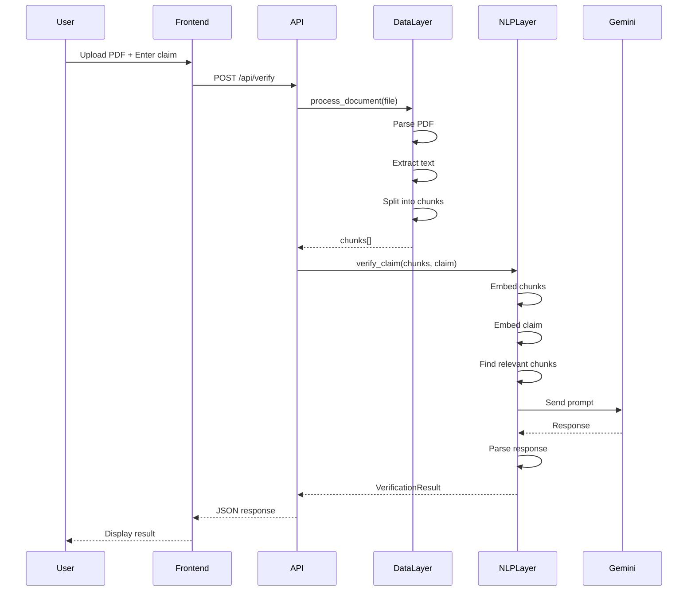
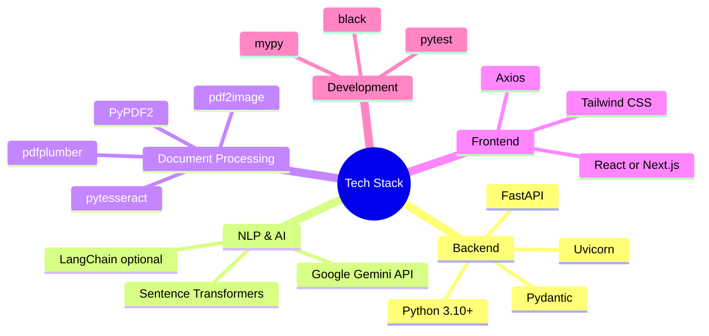
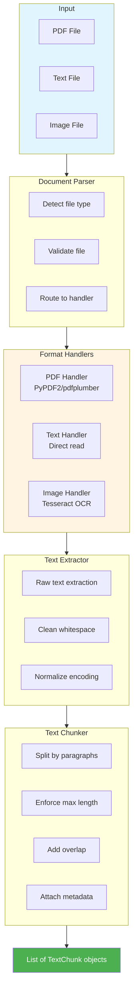
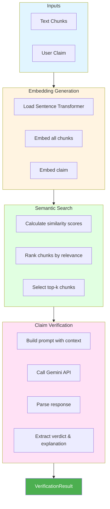
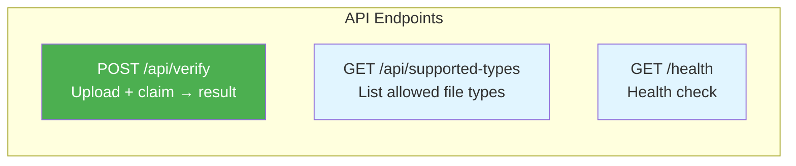
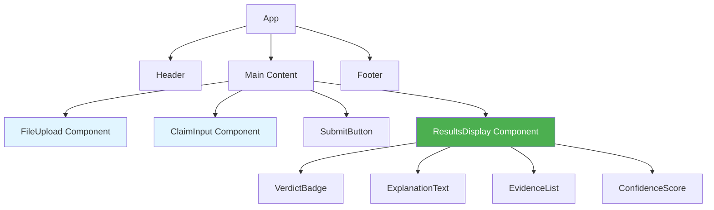
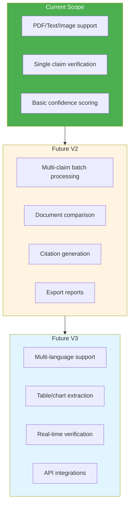

# Contradiction Detection System

## Technical Architecture & Implementation Guide

---

## 1. System Overview

### 1.1 High-Level Architecture



### 1.2 Request Flow



---

## 2. Technology Stack

### 2.1 Overview



### 2.2 Dependencies

```
# requirements.txt

# API Framework
fastapi==0.109.0
uvicorn==0.27.0
python-multipart==0.0.6
pydantic==2.5.0

# Document Processing
PyPDF2==3.0.1
pdfplumber==0.10.3
pytesseract==0.3.10
pdf2image==1.16.3
Pillow==10.2.0

# NLP & AI
google-generativeai==0.3.2
sentence-transformers==2.3.1
numpy==1.26.3

# Optional: LangChain for advanced features
# langchain==0.1.0
# langchain-google-genai==0.0.6

# Development
pytest==7.4.4
python-dotenv==1.0.0
```

---

## 3. Project Structure

```
contradiction-detection-system/
├── README.md
├── requirements.txt
├── .env.example
├── .gitignore
│
├── docs/
│   ├── 01_conceptual_framework.md
│   ├── 02_technical_architecture.md
│   └── 04_nlp_layer_implementation.md
│
├── backend/
│   ├── __init__.py
│   ├── main.py                 # FastAPI app entry point
│   ├── config.py               # Configuration management
│   │
│   ├── api/
│   │   ├── __init__.py
│   │   ├── routes.py           # API endpoints
│   │   └── models.py           # Pydantic request/response models
│   │
│   ├── data_layer/
│   │   ├── __init__.py
│   │   ├── parser.py           # Document parsing logic
│   │   ├── extractor.py        # Text extraction
│   │   └── chunker.py          # Text chunking
│   │
│   └── nlp_layer/
│       ├── __init__.py
│       ├── embeddings.py       # Embedding generation
│       ├── search.py           # Semantic search
│       ├── verifier.py         # Claim verification logic
│       └── gemini_client.py    # Gemini API wrapper
│
├── frontend/                    # React/Next.js app
│   ├── package.json
│   ├── src/
│   │   ├── components/
│   │   ├── pages/
│   │   └── services/
│   └── ...
│
└── tests/
    ├── __init__.py
    ├── test_data_layer.py
    ├── test_nlp_layer.py
    └── test_api.py
```

---

## 4. Data Layer Implementation

### 4.1 Architecture



### 4.2 Data Models

```python
# backend/api/models.py

from pydantic import BaseModel
from typing import List, Optional
from enum import Enum

class Verdict(str, Enum):
    TRUE = "TRUE"
    FALSE = "FALSE"
    PARTIALLY_TRUE = "PARTIALLY_TRUE"
    CANNOT_DETERMINE = "CANNOT_DETERMINE"

class TextChunk(BaseModel):
    """A chunk of text from the source document."""
    content: str
    chunk_index: int
    page_number: Optional[int] = None
    metadata: dict = {}

class VerificationRequest(BaseModel):
    """Request to verify a claim."""
    claim: str
    # Document is uploaded as file, not in JSON body

class VerificationResult(BaseModel):
    """Result of claim verification."""
    verdict: Verdict
    explanation: str
    evidence: List[str]
    confidence: float  # 0.0 to 1.0
    relevant_chunks: List[TextChunk]

class ErrorResponse(BaseModel):
    """Error response."""
    error: str
    detail: Optional[str] = None
```

### 4.3 Document Parser

```python
# backend/data_layer/parser.py

from pathlib import Path
from typing import Union
import PyPDF2
import pdfplumber
from PIL import Image
import pytesseract

class DocumentParser:
    """Handles parsing of different document types."""

    SUPPORTED_TYPES = {'.pdf', '.txt', '.png', '.jpg', '.jpeg'}

    def parse(self, file_path: Union[str, Path]) -> str:
        """
        Parse a document and return extracted text.

        Args:
            file_path: Path to the document

        Returns:
            Extracted text content
        """
        path = Path(file_path)
        suffix = path.suffix.lower()

        if suffix not in self.SUPPORTED_TYPES:
            raise ValueError(f"Unsupported file type: {suffix}")

        if suffix == '.pdf':
            return self._parse_pdf(path)
        elif suffix == '.txt':
            return self._parse_text(path)
        else:  # Image files
            return self._parse_image(path)

    def _parse_pdf(self, path: Path) -> str:
        """Extract text from PDF using pdfplumber."""
        text_parts = []
        with pdfplumber.open(path) as pdf:
            for page in pdf.pages:
                text = page.extract_text()
                if text:
                    text_parts.append(text)
        return "\n\n".join(text_parts)

    def _parse_text(self, path: Path) -> str:
        """Read text file directly."""
        return path.read_text(encoding='utf-8')

    def _parse_image(self, path: Path) -> str:
        """Extract text from image using OCR."""
        image = Image.open(path)
        return pytesseract.image_to_string(image)
```

### 4.4 Text Chunker

```python
# backend/data_layer/chunker.py

from typing import List
from backend.api.models import TextChunk

class TextChunker:
    """Splits text into chunks for processing."""

    def __init__(
        self,
        chunk_size: int = 500,
        chunk_overlap: int = 50
    ):
        self.chunk_size = chunk_size
        self.chunk_overlap = chunk_overlap

    def chunk(self, text: str) -> List[TextChunk]:
        """
        Split text into overlapping chunks.

        Args:
            text: Full document text

        Returns:
            List of TextChunk objects
        """
        # Clean and normalize text
        text = self._clean_text(text)

        # Split into chunks
        chunks = []
        start = 0
        chunk_index = 0

        while start < len(text):
            end = start + self.chunk_size
            chunk_text = text[start:end]

            # Try to end at a sentence boundary
            if end < len(text):
                last_period = chunk_text.rfind('.')
                if last_period > self.chunk_size * 0.5:
                    end = start + last_period + 1
                    chunk_text = text[start:end]

            chunks.append(TextChunk(
                content=chunk_text.strip(),
                chunk_index=chunk_index
            ))

            chunk_index += 1
            start = end - self.chunk_overlap

        return chunks

    def _clean_text(self, text: str) -> str:
        """Clean and normalize text."""
        # Remove excessive whitespace
        import re
        text = re.sub(r'\s+', ' ', text)
        return text.strip()
```

---

## 5. NLP Layer Implementation

### 5.1 Architecture



### 5.2 Embedding Generator

```python
# backend/nlp_layer/embeddings.py

from sentence_transformers import SentenceTransformer
from typing import List
import numpy as np

class EmbeddingGenerator:
    """Generates embeddings using Sentence Transformers."""

    def __init__(self, model_name: str = "all-MiniLM-L6-v2"):
        """
        Initialize with a sentence transformer model.

        Args:
            model_name: HuggingFace model name
        """
        self.model = SentenceTransformer(model_name)

    def embed(self, texts: List[str]) -> np.ndarray:
        """
        Generate embeddings for a list of texts.

        Args:
            texts: List of text strings

        Returns:
            NumPy array of embeddings (n_texts x embedding_dim)
        """
        return self.model.encode(texts, convert_to_numpy=True)

    def embed_single(self, text: str) -> np.ndarray:
        """Embed a single text string."""
        return self.model.encode([text], convert_to_numpy=True)[0]
```

### 5.3 Semantic Search

```python
# backend/nlp_layer/search.py

from typing import List, Tuple
import numpy as np
from backend.api.models import TextChunk

class SemanticSearch:
    """Finds relevant chunks using cosine similarity."""

    def __init__(self, embedding_generator):
        self.embedder = embedding_generator
        self.chunk_embeddings = None
        self.chunks = None

    def index_chunks(self, chunks: List[TextChunk]):
        """
        Index chunks for searching.

        Args:
            chunks: List of TextChunk objects
        """
        self.chunks = chunks
        texts = [chunk.content for chunk in chunks]
        self.chunk_embeddings = self.embedder.embed(texts)

    def search(
        self,
        query: str,
        top_k: int = 5
    ) -> List[Tuple[TextChunk, float]]:
        """
        Find top-k most relevant chunks for a query.

        Args:
            query: The claim/query text
            top_k: Number of results to return

        Returns:
            List of (chunk, similarity_score) tuples
        """
        if self.chunk_embeddings is None:
            raise ValueError("No chunks indexed. Call index_chunks first.")

        # Embed the query
        query_embedding = self.embedder.embed_single(query)

        # Calculate cosine similarities
        similarities = self._cosine_similarity(
            query_embedding,
            self.chunk_embeddings
        )

        # Get top-k indices
        top_indices = np.argsort(similarities)[-top_k:][::-1]

        # Return chunks with scores
        results = []
        for idx in top_indices:
            results.append((self.chunks[idx], float(similarities[idx])))

        return results

    def _cosine_similarity(
        self,
        query_vec: np.ndarray,
        doc_vecs: np.ndarray
    ) -> np.ndarray:
        """Calculate cosine similarity between query and documents."""
        query_norm = query_vec / np.linalg.norm(query_vec)
        doc_norms = doc_vecs / np.linalg.norm(doc_vecs, axis=1, keepdims=True)
        return np.dot(doc_norms, query_norm)
```

### 5.4 Gemini API Client

```python
# backend/nlp_layer/gemini_client.py

import google.generativeai as genai
from typing import Optional
import os

class GeminiClient:
    """Client for Google Gemini API."""

    def __init__(self, api_key: Optional[str] = None):
        """
        Initialize Gemini client.

        Args:
            api_key: Gemini API key (or use GEMINI_API_KEY env var)
        """
        api_key = api_key or os.getenv("GEMINI_API_KEY")
        if not api_key:
            raise ValueError("GEMINI_API_KEY not provided")

        genai.configure(api_key=api_key)
        self.model = genai.GenerativeModel('gemini-pro')

    def generate(self, prompt: str) -> str:
        """
        Generate a response from Gemini.

        Args:
            prompt: The prompt to send

        Returns:
            Generated text response
        """
        response = self.model.generate_content(prompt)
        return response.text
```

### 5.5 Claim Verifier

```python
# backend/nlp_layer/verifier.py

from typing import List
from backend.api.models import TextChunk, VerificationResult, Verdict
from backend.nlp_layer.gemini_client import GeminiClient
from backend.nlp_layer.embeddings import EmbeddingGenerator
from backend.nlp_layer.search import SemanticSearch
import json
import re

class ClaimVerifier:
    """Verifies claims against source documents."""

    PROMPT_TEMPLATE = """You are a fact-checking assistant. Your task is to verify a claim against the provided source text.

SOURCE TEXT:
{context}

CLAIM TO VERIFY:
{claim}

Analyze the claim against the source text and respond with a JSON object containing:
- "verdict": One of "TRUE", "FALSE", "PARTIALLY_TRUE", or "CANNOT_DETERMINE"
- "explanation": A clear explanation of why you reached this verdict
- "evidence": A list of relevant quotes from the source text that support your verdict
- "confidence": A number between 0 and 1 indicating your confidence

IMPORTANT:
- Only use information from the provided source text
- If the source doesn't contain relevant information, use "CANNOT_DETERMINE"
- Be precise and cite specific evidence from the source

Respond ONLY with the JSON object, no other text."""

    def __init__(self):
        self.gemini = GeminiClient()
        self.embedder = EmbeddingGenerator()
        self.search = SemanticSearch(self.embedder)

    def verify(
        self,
        chunks: List[TextChunk],
        claim: str,
        top_k: int = 5
    ) -> VerificationResult:
        """
        Verify a claim against document chunks.

        Args:
            chunks: List of text chunks from the source document
            claim: The claim to verify
            top_k: Number of relevant chunks to use

        Returns:
            VerificationResult with verdict and explanation
        """
        # Index the chunks
        self.search.index_chunks(chunks)

        # Find relevant chunks
        relevant = self.search.search(claim, top_k=top_k)
        relevant_chunks = [chunk for chunk, score in relevant]

        # Build context from relevant chunks
        context = "\n\n".join([
            f"[Chunk {c.chunk_index}]: {c.content}"
            for c in relevant_chunks
        ])

        # Build prompt
        prompt = self.PROMPT_TEMPLATE.format(
            context=context,
            claim=claim
        )

        # Call Gemini
        response = self.gemini.generate(prompt)

        # Parse response
        return self._parse_response(response, relevant_chunks)

    def _parse_response(
        self,
        response: str,
        relevant_chunks: List[TextChunk]
    ) -> VerificationResult:
        """Parse Gemini's JSON response into VerificationResult."""
        try:
            # Extract JSON from response
            json_match = re.search(r'\{.*\}', response, re.DOTALL)
            if json_match:
                data = json.loads(json_match.group())
            else:
                raise ValueError("No JSON found in response")

            return VerificationResult(
                verdict=Verdict(data.get("verdict", "CANNOT_DETERMINE")),
                explanation=data.get("explanation", ""),
                evidence=data.get("evidence", []),
                confidence=float(data.get("confidence", 0.5)),
                relevant_chunks=relevant_chunks
            )
        except (json.JSONDecodeError, KeyError, ValueError) as e:
            # Return a fallback result on parse error
            return VerificationResult(
                verdict=Verdict.CANNOT_DETERMINE,
                explanation=f"Error parsing response: {str(e)}",
                evidence=[],
                confidence=0.0,
                relevant_chunks=relevant_chunks
            )
```

---

## 6. API Layer Implementation

### 6.1 FastAPI Application

```python
# backend/main.py

from fastapi import FastAPI
from fastapi.middleware.cors import CORSMiddleware
from backend.api.routes import router

app = FastAPI(
    title="Contradiction Detection System",
    description="Verify claims against source documents",
    version="1.0.0"
)

# CORS middleware for frontend
app.add_middleware(
    CORSMiddleware,
    allow_origins=["http://localhost:3000"],  # Frontend URL
    allow_credentials=True,
    allow_methods=["*"],
    allow_headers=["*"],
)

# Include API routes
app.include_router(router, prefix="/api")

@app.get("/health")
async def health_check():
    return {"status": "healthy"}
```

### 6.2 API Routes

```python
# backend/api/routes.py

from fastapi import APIRouter, UploadFile, File, Form, HTTPException
from backend.api.models import VerificationResult, ErrorResponse
from backend.data_layer.parser import DocumentParser
from backend.data_layer.chunker import TextChunker
from backend.nlp_layer.verifier import ClaimVerifier
import tempfile
import os

router = APIRouter()

# Initialize components
parser = DocumentParser()
chunker = TextChunker(chunk_size=500, chunk_overlap=50)
verifier = ClaimVerifier()


@router.post(
    "/verify",
    response_model=VerificationResult,
    responses={400: {"model": ErrorResponse}}
)
async def verify_claim(
    file: UploadFile = File(...),
    claim: str = Form(...)
):
    """
    Verify a claim against an uploaded document.

    - **file**: PDF, TXT, or image file
    - **claim**: The statement to verify
    """
    # Validate file type
    allowed_types = {'.pdf', '.txt', '.png', '.jpg', '.jpeg'}
    file_ext = os.path.splitext(file.filename)[1].lower()

    if file_ext not in allowed_types:
        raise HTTPException(
            status_code=400,
            detail=f"Unsupported file type: {file_ext}"
        )

    # Save uploaded file temporarily
    with tempfile.NamedTemporaryFile(
        delete=False,
        suffix=file_ext
    ) as tmp:
        content = await file.read()
        tmp.write(content)
        tmp_path = tmp.name

    try:
        # Parse document
        text = parser.parse(tmp_path)

        if not text.strip():
            raise HTTPException(
                status_code=400,
                detail="Could not extract text from document"
            )

        # Chunk text
        chunks = chunker.chunk(text)

        # Verify claim
        result = verifier.verify(chunks, claim)

        return result

    finally:
        # Clean up temp file
        os.unlink(tmp_path)


@router.get("/supported-types")
async def get_supported_types():
    """Get list of supported document types."""
    return {
        "supported_types": [".pdf", ".txt", ".png", ".jpg", ".jpeg"],
        "max_file_size_mb": 10
    }
```

### 6.3 API Endpoint Summary



| Endpoint               | Method | Description          | Input        | Output             |
| ---------------------- | ------ | -------------------- | ------------ | ------------------ |
| `/api/verify`          | POST   | Verify a claim       | file + claim | VerificationResult |
| `/api/supported-types` | GET    | List supported types | -            | List of extensions |
| `/health`              | GET    | Health check         | -            | Status             |

---

## 7. Frontend Overview

### 7.1 Component Structure



### 7.2 UI Mockup

```
┌─────────────────────────────────────────────────────────┐
│  📄 Contradiction Detection System                      │
├─────────────────────────────────────────────────────────┤
│                                                         │
│  ┌─────────────────────────────────────────────────┐   │
│  │  📁 Upload Source Document                       │   │
│  │  ┌─────────────────────────────────┐            │   │
│  │  │    Drag & drop file here        │            │   │
│  │  │    or click to browse           │            │   │
│  │  │    PDF, TXT, PNG, JPG           │            │   │
│  │  └─────────────────────────────────┘            │   │
│  │  📄 sales_report_q3.pdf ✓                       │   │
│  └─────────────────────────────────────────────────┘   │
│                                                         │
│  ┌─────────────────────────────────────────────────┐   │
│  │  💬 Enter Claim to Verify                        │   │
│  │  ┌─────────────────────────────────────────┐    │   │
│  │  │ Q3 revenue increased by 25% compared    │    │   │
│  │  │ to Q2                                   │    │   │
│  │  └─────────────────────────────────────────┘    │   │
│  │                              [ Verify Claim ]    │   │
│  └─────────────────────────────────────────────────┘   │
│                                                         │
│  ┌─────────────────────────────────────────────────┐   │
│  │  📊 Verification Result                          │   │
│  │                                                  │   │
│  │  Verdict: ⚠️ PARTIALLY TRUE                     │   │
│  │  Confidence: 85%                                │   │
│  │                                                  │   │
│  │  Explanation:                                   │   │
│  │  The claim is partially accurate. Revenue did  │   │
│  │  increase, but by 10.5%, not 25%.              │   │
│  │                                                  │   │
│  │  Evidence:                                      │   │
│  │  • "Q3 2025 revenue: $2.1M" (page 3)           │   │
│  │  • "Q2 2025 revenue: $1.9M" (page 2)           │   │
│  └─────────────────────────────────────────────────┘   │
│                                                         │
└─────────────────────────────────────────────────────────┘
```

---

## 8. Configuration

### 8.1 Environment Variables

```python
# backend/config.py

from pydantic_settings import BaseSettings

class Settings(BaseSettings):
    """Application settings loaded from environment."""

    # Gemini API
    gemini_api_key: str

    # Server
    host: str = "0.0.0.0"
    port: int = 8000
    debug: bool = False

    # Document Processing
    max_file_size_mb: int = 10
    chunk_size: int = 500
    chunk_overlap: int = 50

    # NLP
    embedding_model: str = "all-MiniLM-L6-v2"
    top_k_chunks: int = 5

    class Config:
        env_file = ".env"

settings = Settings()
```

### 8.2 Example .env File

```bash
# .env.example

# Required: Gemini API Key
GEMINI_API_KEY=your-gemini-api-key-here

# Server Configuration
HOST=0.0.0.0
PORT=8000
DEBUG=false

# Document Processing
MAX_FILE_SIZE_MB=10
CHUNK_SIZE=500
CHUNK_OVERLAP=50

# NLP Configuration
EMBEDDING_MODEL=all-MiniLM-L6-v2
TOP_K_CHUNKS=5
```

---

## 9. Running the System

### 9.1 Backend Setup

```bash
# 1. Create virtual environment
python -m venv venv
source venv/bin/activate  # Windows: venv\Scripts\activate

# 2. Install dependencies
pip install -r requirements.txt

# 3. Set up environment
cp .env.example .env
# Edit .env and add your GEMINI_API_KEY

# 4. Run the server
uvicorn backend.main:app --reload --host 0.0.0.0 --port 8000
```

### 9.2 Frontend Setup (React)

```bash
# 1. Navigate to frontend directory
cd frontend

# 2. Install dependencies
npm install

# 3. Start development server
npm run dev
```

### 9.3 Testing the API

```bash
# Test with curl
curl -X POST "http://localhost:8000/api/verify" \
  -F "file=@sales_report.pdf" \
  -F "claim=Revenue increased by 25%"
```

---

## 10. Testing

### 10.1 Test Structure

```python
# tests/test_nlp_layer.py

import pytest
from backend.nlp_layer.embeddings import EmbeddingGenerator
from backend.nlp_layer.search import SemanticSearch
from backend.api.models import TextChunk

class TestEmbeddingGenerator:
    def test_embed_single(self):
        embedder = EmbeddingGenerator()
        embedding = embedder.embed_single("Hello world")
        assert embedding.shape == (384,)  # MiniLM dimension

    def test_embed_batch(self):
        embedder = EmbeddingGenerator()
        embeddings = embedder.embed(["Hello", "World"])
        assert embeddings.shape == (2, 384)

class TestSemanticSearch:
    def test_search_returns_relevant(self):
        embedder = EmbeddingGenerator()
        search = SemanticSearch(embedder)

        chunks = [
            TextChunk(content="Revenue in Q3 was $5 million", chunk_index=0),
            TextChunk(content="The company has 100 employees", chunk_index=1),
            TextChunk(content="Q3 sales exceeded expectations", chunk_index=2),
        ]

        search.index_chunks(chunks)
        results = search.search("What was the Q3 revenue?", top_k=2)

        # Should return revenue-related chunks first
        assert "revenue" in results[0][0].content.lower() or \
               "sales" in results[0][0].content.lower()
```

---

## 11. Future Enhancements



---

## Appendix: Quick Reference

### API Response Format

```json
{
  "verdict": "PARTIALLY_TRUE",
  "explanation": "The claim about revenue growth is partially accurate...",
  "evidence": ["Q3 revenue: $2.1M (page 3)", "Q2 revenue: $1.9M (page 2)"],
  "confidence": 0.85,
  "relevant_chunks": [
    {
      "content": "Q3 2025 financial results...",
      "chunk_index": 5,
      "page_number": 3
    }
  ]
}
```

### Error Response Format

```json
{
  "error": "Unsupported file type",
  "detail": "File type .docx is not supported. Use PDF, TXT, or image files."
}
```
